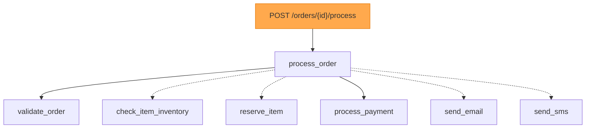

# tracemaid

OpenTelemetry trace analysis and Mermaid diagram generation library.

[](https://pypi.org/project/tracemaid/)
[](https://www.python.org/downloads/)
[](https://opensource.org/licenses/MIT)

## Overview

tracemaid automatically converts OpenTelemetry traces into Mermaid diagrams. It uses machine learning algorithms (ConvexHull + K-Means clustering) to intelligently select the most important spans when traces are too large, ensuring readable visualizations.

## Installation

```bash
# Basic installation
pip install tracemaid

# With FastAPI integration
pip install tracemaid[fastapi]

# With all instrumentations (requests, httpx, sqlalchemy, redis)
pip install tracemaid[instrumentation]

# Everything
pip install tracemaid[all]
```

## Quick Start

### Automatic Tracing with FastAPI (Recommended)

The easiest way to use tracemaid - automatic Mermaid diagrams for every request:

```python
from fastapi import FastAPI
from tracemaid.integrations import setup_fastapi_tracing, instrument_all

app = FastAPI()

# Setup automatic tracing - diagrams saved to ./traces/
setup_fastapi_tracing(app, service_name="my-api", output_dir="./traces")

# Enable instrumentation for HTTP clients, databases, etc.
instrument_all()

@app.get("/users/{user_id}")
async def get_user(user_id: str):
    return {"user_id": user_id}

# Every request now generates a Mermaid diagram!
```

### Using TracemaidExporter Directly

For more control, use the exporter directly with OpenTelemetry:

```python
from opentelemetry import trace
from opentelemetry.sdk.trace import TracerProvider
from opentelemetry.sdk.trace.export import BatchSpanProcessor
from tracemaid import TracemaidExporter

# Create and configure the exporter
exporter = TracemaidExporter(
    output_dir="./traces",
    max_spans=10,           # Select top 10 most important spans
    enable_styling=True,    # Color-code errors and slow spans
    console_output=True,    # Also print to console
)

# Set up OpenTelemetry
provider = TracerProvider()
provider.add_span_processor(BatchSpanProcessor(exporter))
trace.set_tracer_provider(provider)

# Use the tracer
tracer = trace.get_tracer(__name__)

with tracer.start_as_current_span("my-operation"):
    # Your code here
    pass
```

### Manual Trace Analysis

Parse existing trace files and generate diagrams:

```python
from tracemaid import OTelParser, SpanSelector, MermaidGenerator

# Parse a trace file
parser = OTelParser()
with open("trace.json", "r") as f:
    trace = parser.parse_json(f.read())

# Select important spans (ConvexHull + K-Means)
selector = SpanSelector(min_points_for_hull=7)
important_spans = selector.select_from_trace(trace, max_spans=10)

# Generate Mermaid diagram
generator = MermaidGenerator()
diagram = generator.generate(important_spans, trace)
print(diagram)
```

### CLI Usage

```bash
# Generate Mermaid diagram from trace file
tracemaid trace.json

# Output to file with max 15 spans
tracemaid trace.json -o diagram.md -n 15

# Include metadata (duration, depth) in labels
tracemaid trace.json --metadata

# JSON output format
tracemaid trace.json --format json

# Disable styling
tracemaid trace.json --no-style

# Show version
tracemaid --version
```

## Auto-Instrumentation

Enable tracing for popular libraries:

```python
from tracemaid.integrations import (
    instrument_requests,     # HTTP requests library
    instrument_httpx,        # HTTPX async client
    instrument_sqlalchemy,   # SQLAlchemy databases
    instrument_redis,        # Redis
    instrument_logging,      # Python logging with trace context
    instrument_all,          # All of the above
)

# Instrument everything at once
results = instrument_all()
print(results)  # {'requests': True, 'httpx': True, 'sqlalchemy': True, ...}

# Or individually
instrument_requests()
instrument_sqlalchemy(engine=my_engine)  # Optional: pass specific engine
instrument_redis(client=my_redis)        # Optional: pass specific client
```

## Features

- **Automatic Span Selection**: Uses ConvexHull (boundary detection) + K-Means (clustering) to select the most important spans
- **6-Dimensional Feature Analysis**:
  - Duration (normalized)
  - Depth in trace tree
  - Child count
  - Error status
  - Is root span
  - Relative start time
- **Mermaid Diagram Generation**:
  - Color-coded nodes (red for errors, orange for slow spans)
  - Parent-child relationships preserved
  - Dotted lines for filtered intermediate spans
- **Multiple Output Formats**: Mermaid diagrams or JSON

## Example Output

When processing an order with 18 spans and `max_spans=10`:

```
TRACE: b86cecee040f865f9d85c019d79380a0
Spans: 9/18 selected   <- 50% reduction while preserving key operations
```

Generated diagram:


## Requirements

- Python 3.9, 3.10, 3.11, 3.12, 3.13
- numpy, scipy, scikit-learn
- opentelemetry-api, opentelemetry-sdk

## Development

```bash
# Clone and install
git clone https://github.com/karthyick/tracemaid.git
cd tracemaid
pip install -e ".[dev]"

# Run tests
pytest

# Run with coverage
pytest --cov=tracemaid
```

## License

MIT License - see [LICENSE](LICENSE) file for details.

## Links

- **PyPI**: https://pypi.org/project/tracemaid/
- **GitHub**: https://github.com/karthyick/tracemaid
- **Issues**: https://github.com/karthyick/tracemaid/issues

## Author

KR - Karthickrajam18@gmail.com
