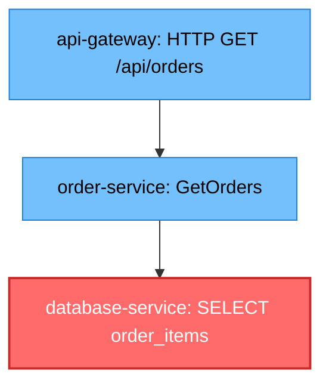

# tracemaid

OpenTelemetry trace analysis and Mermaid diagram generation library.

## Overview

tracemaid is a Python library that parses OpenTelemetry traces, extracts meaningful features from spans, selects the most important spans using machine learning clustering algorithms, and generates Mermaid diagrams for visualization.

## Features

- **Trace Parsing**: Parse OpenTelemetry JSON/OTLP trace formats into structured Span and Trace objects
- **Feature Extraction**: Extract 6-dimensional feature vectors from spans for analysis:
  - Duration (normalized to [0,1] range)
  - Depth in trace tree (normalized)
  - Child count (normalized)
  - Error status (binary flag)
  - Is root span (binary flag)
  - Relative start time
- **Intelligent Span Selection**: Select important spans using:
  - Convex Hull algorithm (boundary spans in feature space)
  - K-Means clustering (representative spans from clusters)
- **Mermaid Diagram Generation**: Generate visual flowchart diagrams:
  - Color-coded nodes (error spans in red, slow spans in orange)
  - Parent-child edge relationships
  - Optional metadata (duration, depth) in labels

## Installation

```bash
# From PyPI (when published)
pip install tracemaid

# From source
git clone https://github.com/karthyick/tracemaid.git
cd tracemaid
pip install -e .

# With development dependencies
pip install -e ".[dev]"
```

## Quick Start

### Python API

```python
from tracemaid import OTelParser, SpanSelector, MermaidGenerator

# Parse a trace file
parser = OTelParser()
with open("trace.json", "r") as f:
    trace = parser.parse_json(f.read())

# Select important spans using ConvexHull + K-Means
selector = SpanSelector()
important_spans = selector.select_from_trace(trace, max_spans=10)

# Generate Mermaid diagram
generator = MermaidGenerator()
diagram = generator.generate(important_spans, trace)
print(diagram)
```

### CLI

```bash
# Analyze a trace and generate a Mermaid diagram (default)
tracemaid trace.json

# Output to a file with max 15 spans
tracemaid trace.json -o diagram.md -n 15

# Generate JSON output with selected spans
tracemaid trace.json --format json

# Include metadata (duration, depth) in diagram labels
tracemaid trace.json --metadata

# Disable styling (colors for error/slow spans)
tracemaid trace.json --no-style

# Verbose mode
tracemaid trace.json -v
```

## Output Examples

### Flowchart Diagram



## Requirements

- Python 3.9+
- numpy
- scipy
- scikit-learn

## Development

```bash
# Install dev dependencies
pip install -e ".[dev]"

# Run tests
pytest

# Run tests with coverage
pytest --cov=tracemaid --cov-report=html
```

## License

MIT License - see LICENSE file for details.

## Author

KR - Karthickrajam18@gmail.com
